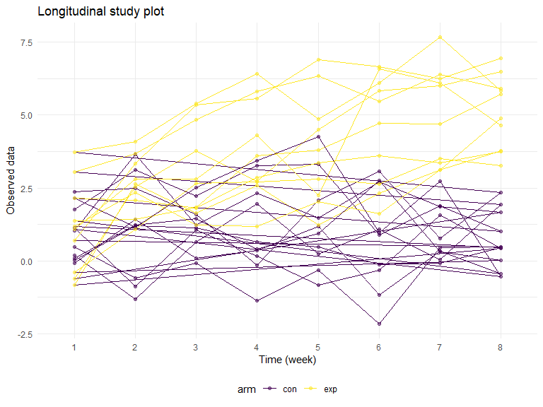
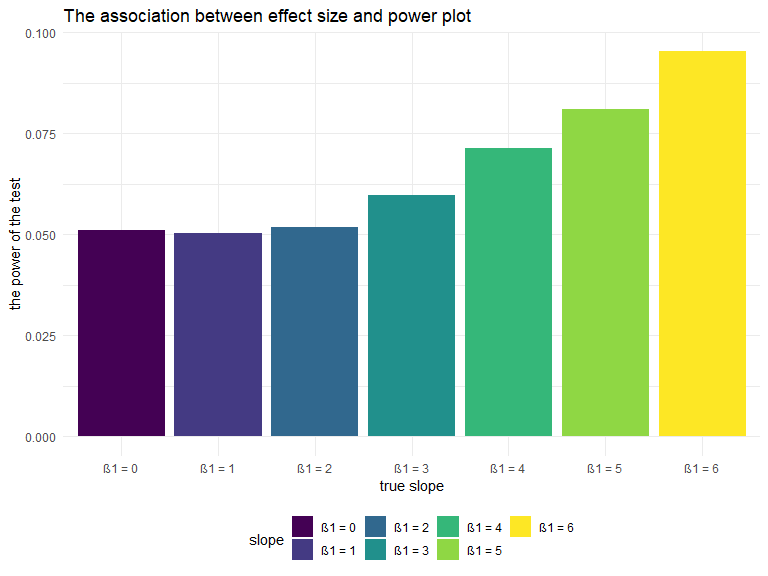
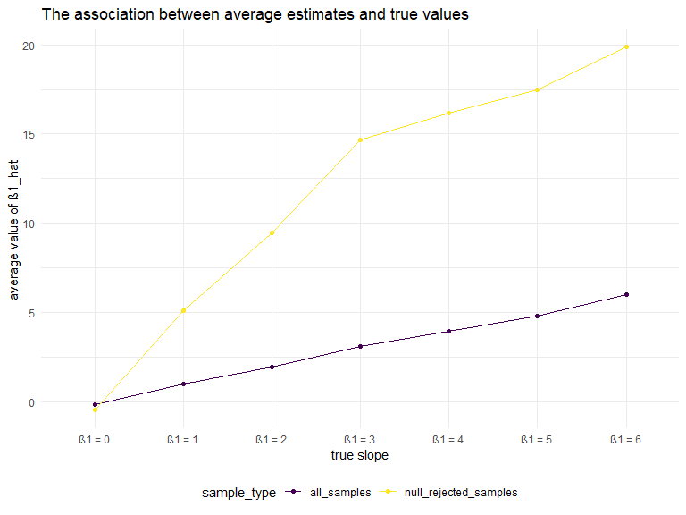

P8105 Homework5 Solution
================
Xun Wang
11/07/2019

This file is the solution to P8105 Homework 5 from Xun Wang (xw2417).

``` r
library(tidyverse)
library(rvest)

knitr::opts_chunk$set(
    echo = TRUE,
    warning = FALSE,
    fig.width = 8, 
  fig.height = 6,
  out.width = "90%"
)

options(
  ggplot2.continuous.colour = "viridis",
  ggplot2.continuous.fill = "viridis"
)

scale_colour_discrete = scale_colour_viridis_d
scale_fill_discrete = scale_fill_viridis_d

theme_set(theme_minimal() + theme(legend.position = "bottom"))

set.seed(10)
```

#### Problem 1

This problem uses the `iris` dataset. The code chunk below loads the
dataset and introduces missing values in each column.

``` r
iris_with_missing = iris %>% 
  map_df(~replace(.x, sample(1:150, 20), NA)) %>%
  mutate(Species = as.character(Species)) %>% 
  janitor::clean_names()
```

The code chunk below generates a function that takes a vector as an
argument; replaces missing values; and returns the resulting vector.

``` r
replace_missing = function(x) {
  
  if (is.numeric(x)) {
    x[is.na(x)] = mean(x, na.rm = TRUE)
  } else if (is.character(x)) {
    x[is.na(x)] = "virginica"
  } else {
    stop("Argument x should be numeric or character")
  }
  x
}
```

The code chunk below replaces missing values in the `iris_with_missing`
with

  - the mean of non-missing values for numeric variables
  - “virginica” for character variables

and generates a `tibble` output.

``` r
iris_complete = map_df(iris_with_missing, replace_missing)

iris_complete
```

    ## # A tibble: 150 x 5
    ##    sepal_length sepal_width petal_length petal_width species
    ##           <dbl>       <dbl>        <dbl>       <dbl> <chr>  
    ##  1         5.1          3.5         1.4         0.2  setosa 
    ##  2         4.9          3           1.4         0.2  setosa 
    ##  3         4.7          3.2         1.3         0.2  setosa 
    ##  4         4.6          3.1         1.5         1.19 setosa 
    ##  5         5            3.6         1.4         0.2  setosa 
    ##  6         5.4          3.9         1.7         0.4  setosa 
    ##  7         5.82         3.4         1.4         0.3  setosa 
    ##  8         5            3.4         1.5         0.2  setosa 
    ##  9         4.4          2.9         1.4         0.2  setosa 
    ## 10         4.9          3.1         3.77        0.1  setosa 
    ## # ... with 140 more rows

#### Problem 2

The code chunk below creates a tidy dataframe containing data from all
participants, including the subject ID, arm, and observations over time.

``` r
file_name = list.files(path = "data")

raw_df = map(.x = file_name, ~ read_csv(str_c("data/", .x))) %>% 
  bind_rows %>%
  mutate(file_name = file_name)
  
longitudinal_study_df = 
  raw_df %>% 
  separate(file_name, c("arm", "id"), sep = "_", remove = TRUE) %>%
  mutate(id = str_replace(id, ".csv", "")) %>% 
  pivot_longer(
    week_1:week_8,
    names_to = "week",
    names_prefix = "week_",
    values_to = "observation"
  ) %>%
  select(id, arm, week, observation) %>% 
  mutate(
    id = as.factor(id),
    arm = as.factor(arm),
    #week = as.factor(week)
  ) 
```

The code chunk below makes a spaghetti plot showing observations on each
subject over time.

``` r
longitudinal_study_df %>%
  ggplot(aes(x = week, y = observation, color = arm)) +
  geom_path(aes(group = id)) +
  geom_point(alpha = .5) + 
  labs(
    title = "Longitudinal study plot",
    x = "Time (week)",
    y = "Observed data"
  )
```



**Comments:** In the beginning of the experiment, the longitudinal data
observed both in the control group and the experimental group are quite
similar, which is around 1.5. When the experiment starts and with time
goes by, the longitudinal data observed in the control group still stays
stable, while the data observed in the experimental group increases to
around 5.0. So the experiment might have a positive effect on the
longitudinal data.

#### Problem 3

In this problem, I conduct a simulation to explore power in a simple
linear regression. The code chunk below generates a function to simulate
data from a simple linear regression, fit the regression model, and
return estimates of regression coefficients.

``` r
sim_regression = function(n = 30, beta0 = 2, beta1) {
  
  sim_data = tibble(
    x = rnorm(n, mean = 0, sd = 1),
    y = beta0 + beta1 * x + rnorm(n, 0, 50)
  )
  
  ls_fit_sum = lm(y ~ x, data = sim_data) %>% broom::tidy()
  
  tibble(
    beta1_hat = ls_fit_sum[[2, 2]],
    p_value = ls_fit_sum[[2, 5]]
  )
}
```

First, I generate 10,000 datasets with *β1* = 0 from the SLR model by
the code chunk below.

``` r
sim_results_0 = 
  rerun(10000, sim_regression(30, 2, 0)) %>% 
  bind_rows()

sim_results_0
```

    ## # A tibble: 10,000 x 2
    ##    beta1_hat  p_value
    ##        <dbl>    <dbl>
    ##  1     14.3  0.207   
    ##  2      8.70 0.182   
    ##  3      4.26 0.606   
    ##  4     21.4  0.000149
    ##  5     -8.42 0.471   
    ##  6    -10.6  0.219   
    ##  7    -13.9  0.192   
    ##  8      2.34 0.769   
    ##  9      4.07 0.670   
    ## 10     17.0  0.134   
    ## # ... with 9,990 more rows

Second, the code chunk below repeats the above for *β1* = 1,2,3,4,5,6,
and generates a dataframe for the simulation results.

``` r
sim_results = 
  tibble(slope = c(0, 1, 2, 3, 4, 5, 6)) %>% 
  mutate(
    output_lists = map(.x = slope, ~rerun(10000, sim_regression(beta1 = .x))),
    estimate_dfs = map(output_lists, bind_rows)) %>% 
  select(-output_lists) %>% 
  unnest(estimate_dfs)

sim_results
```

    ## # A tibble: 70,000 x 3
    ##    slope beta1_hat p_value
    ##    <dbl>     <dbl>   <dbl>
    ##  1     0     -6.45  0.491 
    ##  2     0     14.9   0.0665
    ##  3     0      5.75  0.473 
    ##  4     0     14.3   0.113 
    ##  5     0      7.50  0.307 
    ##  6     0    -10.5   0.196 
    ##  7     0      4.74  0.573 
    ##  8     0     -8.80  0.451 
    ##  9     0      1.58  0.876 
    ## 10     0      1.56  0.856 
    ## # ... with 69,990 more rows

Third, the code chunk below makes a plot showing the proportion of times
the null was rejected (the power of the test) on the y axis and the true
value of β1 on the x axis. Describe the association between effect size
and power.

``` r
sim_results %>% 
  group_by(slope) %>% 
  summarize(
    power = sum(p_value <= 0.05) / n()
  ) %>% 
  mutate(
    slope = str_c("β1 = ", slope),
    slope = fct_inorder(slope)) %>% 
  ggplot(aes(x = slope, y = power, fill = slope)) + 
  geom_bar(stat = 'identity') +
  labs(
    title = "The association between effect size and power plot",
    x = "true slope",
    y = "the power of the test"
  )
```



**Comments:** From the figure above, we can see when the effect size β1
increase, the power of the test increases. So larger effect size means
more power.

Last, the code chunk below makes plots showing the relationship of
average estimate of β1\_hat and β1.

``` r
table_1 = 
  sim_results %>% 
  group_by(slope) %>% 
  summarize(
    all_samples = mean(beta1_hat, na.rm = TRUE)
  )

table_2 = 
  sim_results %>% 
  filter(p_value <= 0.05) %>% 
  group_by(slope) %>% 
  summarize(
    null_rejected_samples = mean(beta1_hat, na.rm = TRUE)
  )

inner_join(table_1, table_2, by = "slope") %>% 
  pivot_longer(
    all_samples:null_rejected_samples,
    names_to = "sample_type",
    values_to = "beta1_hat_average"
  ) %>% 
  mutate(
    slope = str_c("β1 = ", slope),
    slope = fct_inorder(slope)) %>% 
  ggplot(aes(x = slope, y = beta1_hat_average, color = sample_type)) + 
  geom_point() +
  geom_line(aes(group = sample_type)) +
  labs(
    title = "The association between average estimates and true values",
    x = "true slope",
    y = "average value of β1_hat "
  )
```



**Comments:** From the figure above, we can see the average estimates of
β1\_hat from both all sampels and samples for which the null was
rejected increase when the true slope incrases. The average estimates of
β1\_hat from all sampels are very close to the true slopes but the
sample average of β1\_hat across tests for which the null is rejected
**isn’t** approximately equal to the true value of β1. This is because
the samples for which the null was rejected can’t persuade people
statistically to accept them and they are “black sheep” in their own
sample group.
